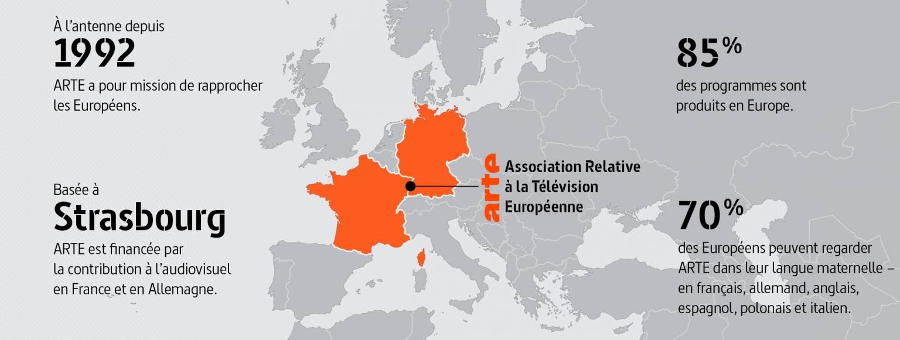
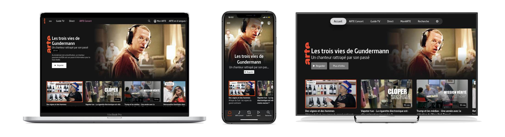

<!-- .slide: data-background="./images/background-cheers.jpg" -->

## Comment ARTE a simplifié le développement multi-plateforme à l’aide d’une API orientée front ?

---

#### ARTE est une chaîne de télévision culturelle européenne :

 <!-- .element width="100%" -->

- disponible en 6 langues (FR, DE, EN, ES, PL et IT)
- programmes disponibles sur internet depuis 2007

---

<!-- .slide: data-background="./images/background-apple-tv-remote.jpg" -->

## Les applications d'ARTE

---

### ARTE est disponible partout (ou presque) :

- sur le web ([arte.tv](https://www.arte.tv/fr/))
- sur mobile et tablette ([iOS](https://apps.apple.com/fr/app/arte/id405028510) et [Android](https://play.google.com/store/apps/details?id=tv.arte.plus7&hl=fr&gl=US))
- sur TV connectée ([HbbTV](https://www.arte.tv/sites/fr/corporate/faq/hbbtv/), [Apple TV](https://apps.apple.com/fr/app/arte/id405028510) et [Android TV](https://play.google.com/store/apps/details?id=tv.arte.plus7&hl=fr&gl=US))
- sur les box FAI ([Free](https://www.arte.tv/fr/) et [Orange](https://www.arte.tv/fr/))

---

### Les particularités des plateformes

Chaque plateforme dispose de ses propres codes et contraintes :

- contrôle à la souris, au doigt ou à la télécommande
- vitesse du réseau (fibre vs 4G)
- format et résolution d'écran variable
- navigation par urls ou par liens profonds

---

### Les liens profonds (ou deeplinks)

À chaque url correspond un lien profond.

```json
{
  "url": "https://www.arte.tv/fr/videos/097461-000-A/robe-noire/",
  "deeplink": "arte://program/097461-000-A",
}
```

- permet d'accéder directement au contenu
- compatible iOS, Android, tvOS et Android TV

---

### Supports différents, expérience unifiée

 <!-- .element width="100%" -->

- même catalogue de programmes
- structures d'application similaires

---

<!-- .slide: data-background="./images/background-cassette.jpg" -->

## Les premières APIs d'ARTE

---

### Approche orientée métier

La structure des premières APIs d'ARTE reflète les entités de la base de données :

- un endpoint par type d'entité (vidéos, collections, ...)
- un même endpoint peut servir pour plusieurs cas d'utilisation

---

### Exemple : le endpoint `/videos`

Pour récupérer les vidéos les plus vues :

```yaml
https://www.arte.tv/api/videos?sort=-views
```

Pour récupérer les vidéos les plus récentes :

```yaml
https://www.arte.tv/api/videos?sort=-availabilityDate
```

---

<!-- .slide: data-background="./images/requests-breakdown.jpg" -->

---

### Problématiques de l'approche orientée métier

- beaucoup d'appels API par écran
- API complexe (de nombreux paramètres à maîtriser)
- contenu des apps front difficile à uniformiser

---

<!-- .slide: data-background="./images/background-ring.jpg" -->

## Une API pour les gouverner toutes

---

### Une API orientée front (ou BFF)

Le BFF (ou Back-end For Front-end) n'est pas un reflet de la base de données mais un reflet de l'application front :

- renvoie des objets `page` consolidés
- récupère les données auprès des APIs orientées métier
- pré-process les données pour les apps front

---

<!-- .slide: data-background="./images/emac-bff.jpg" -->

---

### Une API au service du front

structure de l'API = structure des apps front

```javascript
[Page]
  - title
  [Zones]
    - title
    - description
    [Teasers]
      - title
      - subtitle
      - image
      - url
      - deeplink
```

- 1 appel API pour récupérer l'intégralité d'un écran
- ne renvoie que les champs utiles
- même call pour tous les supports

---

<!-- .slide: data-background="./images/screenshot-page-web.jpg" -->

---

<!-- .slide: data-background="./images/screenshot-page-ipad.jpg" -->

---

<!-- .slide: data-background="./images/background-cirque.jpg" -->

## Et pourquoi pas GraphQL ?

---

### Les promesses de GraphQL :

- limiter les appels API
- offrir plus de liberté aux front
- mettre fin au versioning

GraphQL semble plus adapté à une API ouverte qu'à une API spécialisée.

---

<!-- .slide: data-background="./images/background-bicycle.jpg" -->

## Comment ce BFF permet de simplifier le développement des apps front ?

---

### En facilitant la vie des développeurs front :

- une seule API à maîtriser
- routing simple et peu de paramètres
- plus besoin de se soucier des problématiques métier

---

### En offrant plus de flexibilité :

- structure éditable sans mise-à-jour côté front
- découple les apps front des APIs métier

---

<!-- .slide: data-background="./images/background-summer.jpg" -->

## Une approche idéale ?

---

### Le BFF est un concept qui ne convient pas à tout le monde :

- nécessite une bonne proximité entre les équipes back et front-end
- l'approche est-elle encore pertinente depuis HTTP/2 ?
- un service de plus à maintenir

---

<!-- .slide: data-background="./images/emac-bff.jpg" -->

---

<!-- .slide: data-background="./images/emac-bff-per-app.jpg" -->

---

<!-- .slide: data-background="./images/background-santa-monica.jpg" -->

## Pour finir...

---

### Ce projet est le fruit d'une collaboration entre [ARTE](https://www.arte.tv/fr/) et [Marmelab](https://marmelab.com/fr/)

- 2 chefs de projet du côté d'ARTE
- 3 développeurs du côté de Marmelab

Une équipe proche du front, orientée web mais en concertation régulière avec les équipes mobile et TV.

---

### Références

- BFFs and GraphQL, terms you should know and why - Chris BAILEY : https://www.youtube.com/watch?v=B5OdK21ZevI
- ARTE’s API strategy & architecture - Matthieu BREEN : https://www.youtube.com/watch?v=bsCOU7131lM
- 6play_API-v2-Final(1).doc - Benoit VIGUIER : https://www.youtube.com/watch?v=Y_umU8mTWho

---

### Merci de nous avoir écoutés ! Des questions ?

#### Ces slides sont disponibles ici :

#### https://artegeie.github.io/Presentation-Forum-PHP-2020/

##### Retrouvez-nous sur Twitter : [@lucaslegname](https://twitter.com/lucaslegname) / [@rmaximedev](https://twitter.com/rmaximedev)
